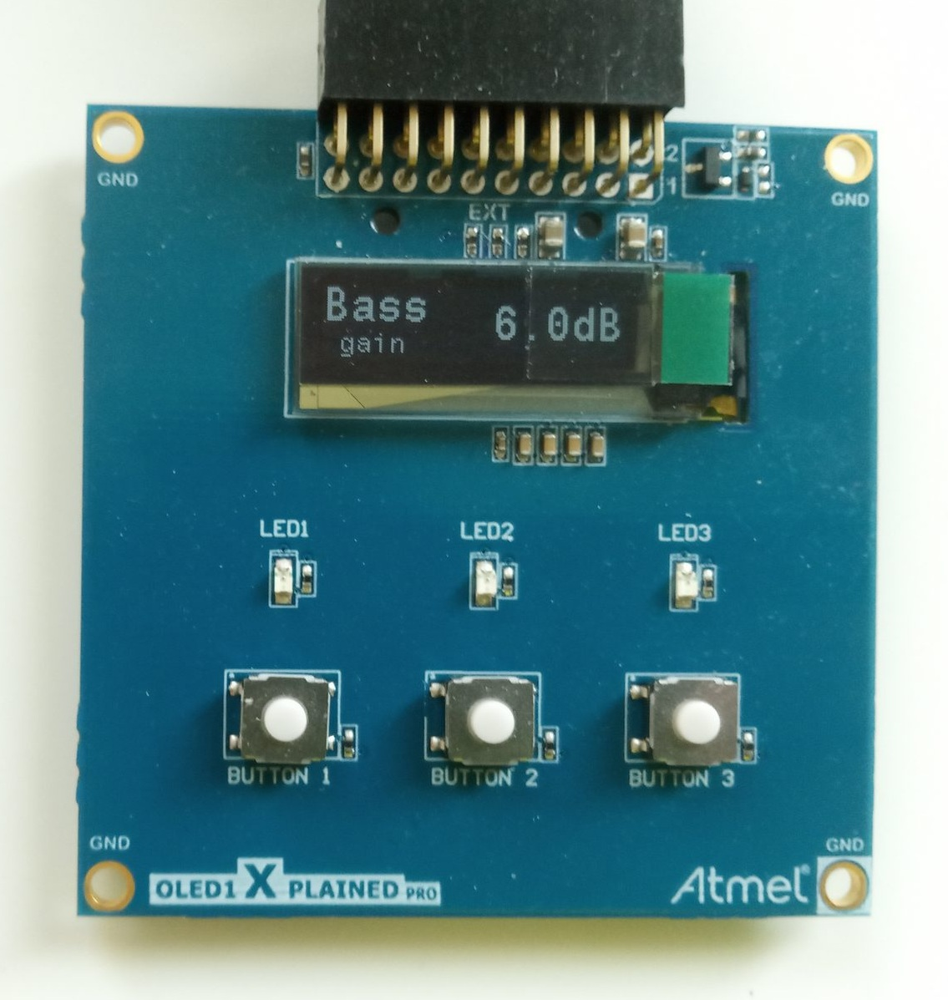
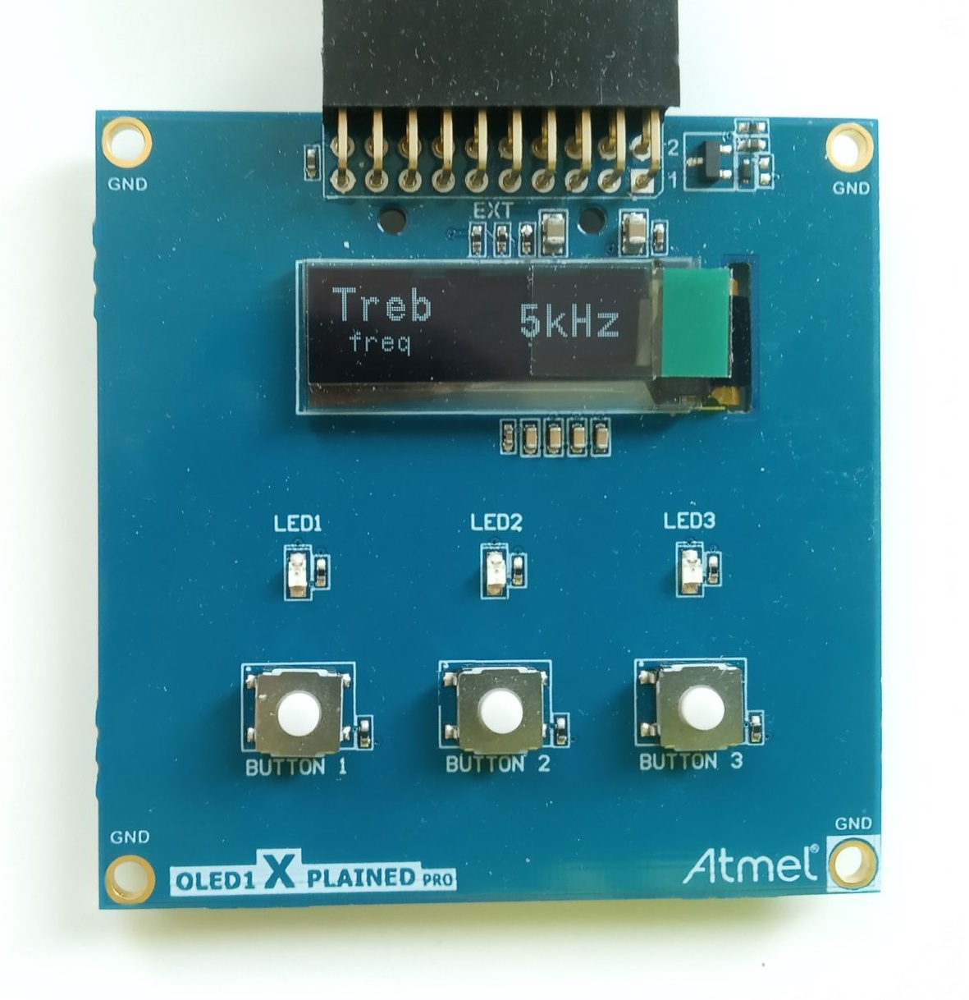
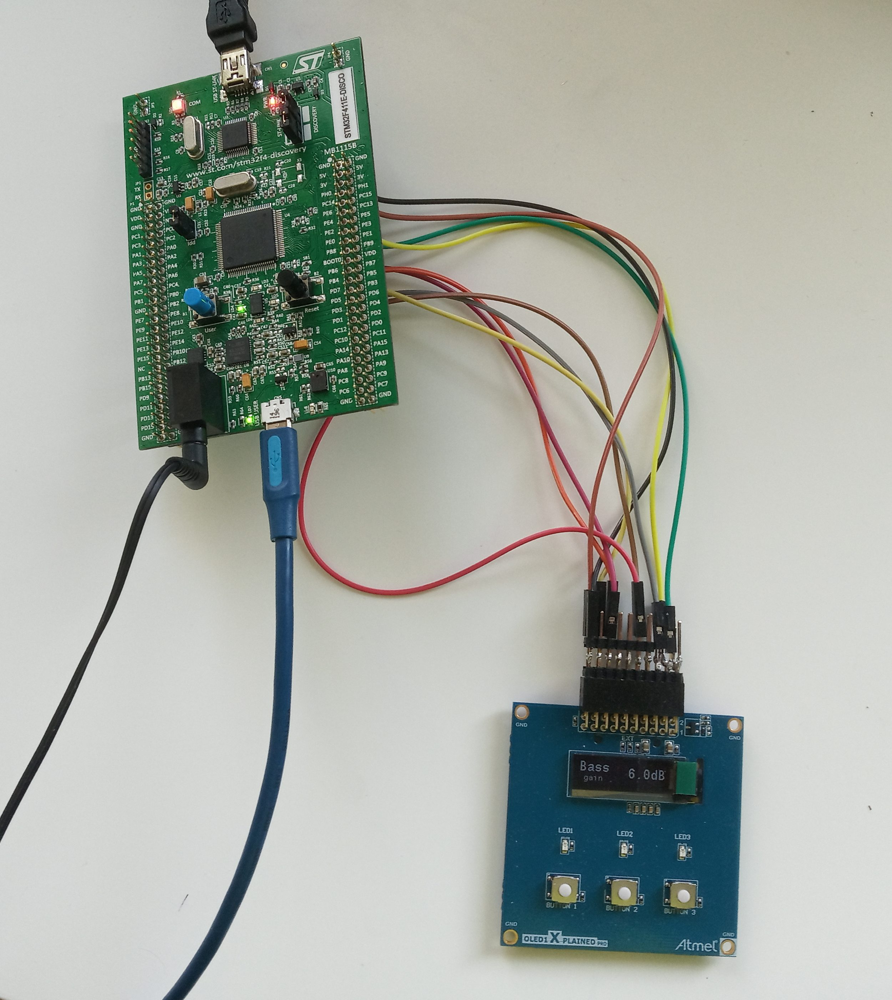

# stm32-disco-sound-card
An UAC1 implementation for the STM32F411-DISCO board with **tone control**!\
What i wanted to achive a long time for now to have a ligh weight USB DAC for my headphones which does not need any special driver and have hardware physical tone contol in the digital domain.\
For this the STM32F411-DISCO board which i had for years seemed to be a really good candidate with it's CS43L22 audio headphone DAC. The project aims for a generic 48kHz 24bit stereo implementation.\
A quick, short, real life demo of the prototype: https://youtu.be/ILklubHfwOU

This project heavily relyes on the tiny USB project:\
https://docs.tinyusb.org/en/latest \
https://github.com/hathach/tinyusb \
Big thank you for the developers! It is a lot better and in depth impelemntation then the middle ware from STM itself.

The project is made by the STM Cube MX, and programmed in their STM32CubeIDE 2.0.0

There is a hand written tool to calculate the best (exact) configuration for the I2S PLL, as STM cube seemed to not support this
tools\i2s-clock-calc.py

Current state of the prototype:
<table>
  <tr>
    <td>
      
    </td>
    <td>
      
    </td>
  </tr>
  <tr>
    <td colspan="2" align="center">
      
    </td>
  </tr>
</table>

Tested with:\
​  ● Windows 11 25H2 and 23H2\
​  ● Windows 10 22H2\
​  ● Ubuntu  22.04 LTS\
​  ● Android 8.1.0 (Huawei Y5 2018)\
​  ● Android 9 (Xiaomi Redmi 6)\
​  ● Android 12 (Samsung Galaxy A41)\
​  ● Android 8.1.0 (Huawei Y5 2018)\
​  ● Android 9 (Xiaomi Redmi 6)\
​  ● Android 12 (Samsung Galaxy A41)

 

Note on how the volume is handled:
- Windows seems to respect that we have a volume control, and sends the full amplitude audio stream and sets the volume by a separate volume value. In this case the DSP can process the audio in full precision, because we are setting the volume only before the DAC
- Ubuntu -> ToDo check
- On all the Android devices I have tried, the volume is set to max on the USB level, and the phone sends the PCM stream scaled to the actual volume

## Hardware
The custom part of the board is designed in KiCad 10.\
Big thanks to the https://www.youtube.com/@HTMWorkshop for the really nice tutorial videos for teaching me KiCad in a few hours.
